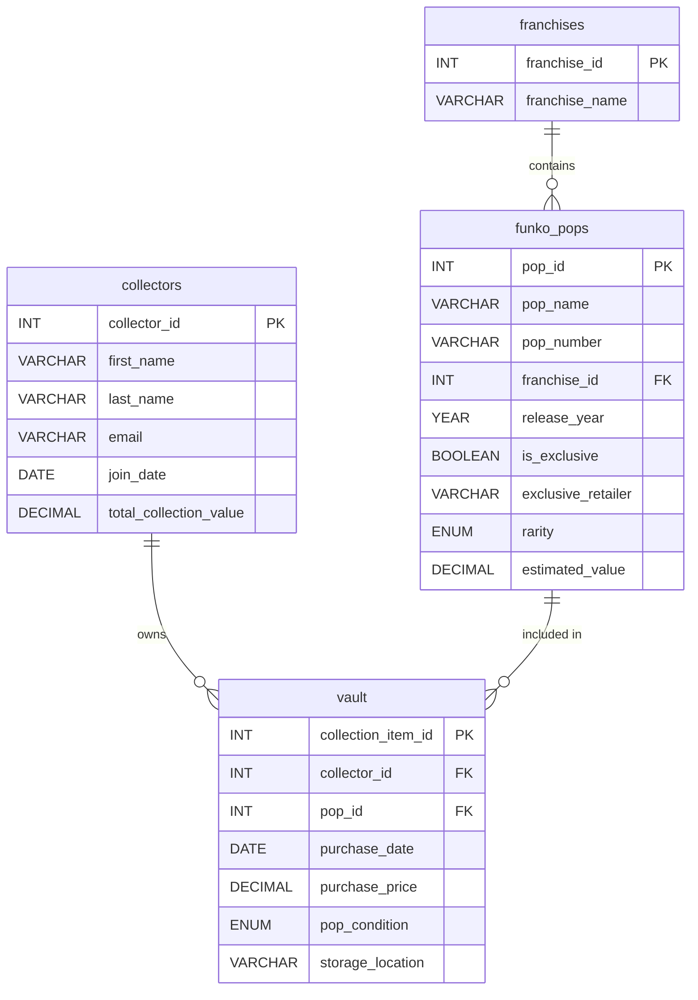

# POPVAULT

## A pocket vault for your Funko Pops


### DATABASE SUMMARY:


###### PopVault is a database I created and designed for Funko Pop collectors of all levels, from casual fans to serious investors. The inspiration for PopVault came from a real collector's frustration. A friend of mine with 342 Funko Pops constantly faced the problem of buying duplicate figures or not buying a figure because he couldn't remember what he already owned. Walking into a comic store and seeing an interesting FunkoPop on the shelf, he would struggle to recall if it was already sitting in a box at home or displayed on one of his many shelves. I soon realized this highlighted the need for a portable, searchable database that collectors could reference anywhere, whether browsing online stores or walking the aisles of their local shop. PopVault solves this problem by putting a collector's entire inventory in their pocket, accessible anytime they need to make a purchasing decision.


### User's Perspective:

###### When collectors join PopVault, they create a profile and build their digital inventory by adding Funko Pops with details like purchase date, price, condition, and storage location. Users can browse by franchise to see what they own and identify missing figures, while the system automatically calculates their total collection value. This organized catalog transforms hundreds of physical pops scattered across shelves and storage boxes into a searchable, manageable database.

###### 

###### The real value shows during shopping trips. Collectors can quickly search for a specific pop on their phone to see if they already own it. Solving the common problem of buying duplicates or forgetting what's at home. Users manage their vault and can generate reports showing their most valuable pieces, spending over time, or collection completion by franchise. PopVault puts a collector's entire inventory in their pocket, making informed purchasing decisions easy and eliminating the frustration of forgotten purchases.

---
## ER DIAGRAM:


## SQL Queries:
---


1. SELECT using ORDER BY two or more columns

Retrieves all Funko Pops ordered first by franchise (grouped together), then by rarity level within each franchise, and finally by estimated value. This is useful when browsing the entire catalog organized by franchise and value, helping collectors identify the most valuable pops within each franchise.

```sql
SELECT fp.pop_name, f.franchise_name, fp.rarity, fp.estimated_value
FROM funko_pops fp
JOIN franchises f ON fp.franchise_id = f.franchise_id
ORDER BY f.franchise_name, fp.rarity DESC, fp.estimated_value DESC
LIMIT 15;
```
```code
+-------------------------+-----------------+----------+-----------------+
| pop_name                | franchise_name  | rarity   | estimated_value |
+-------------------------+-----------------+----------+-----------------+
| Levi Ackerman           | Attack on Titan | Rare     |           95.00 |
| Eren Yeager             | Attack on Titan | Rare     |           85.00 |
| Mikasa Ackerman         | Attack on Titan | Rare     |           78.00 |
| Colossal Titan (6 inch) | Attack on Titan | Uncommon |           38.00 |
| Armin Arlert            | Attack on Titan | Uncommon |           32.00 |
| Erwin Smith             | Attack on Titan | Uncommon |           28.00 |
| Annie Leonhart          | Attack on Titan | Common   |           18.00 |
| Hange Zoe               | Attack on Titan | Common   |           16.00 |
| Batman (Dark Knight)    | Batman          | Rare     |          125.00 |
| The Joker               | DC Comics       | Grail    |          610.00 |
| Batman                  | DC Comics       | Grail    |          580.00 |
| Superman                | DC Comics       | Grail    |          520.00 |
| Wonder Woman            | DC Comics       | Grail    |          490.00 |
| Robin                   | DC Comics       | Rare     |           82.00 |
| Green Lantern           | DC Comics       | Rare     |           75.00 |
+-------------------------+-----------------+----------+-----------------+
```
----

2.SELECT using a calculated field with meaningful column heading

&nbsp;This query calculates how many years ago each Funko Pop was released by subtracting the release year from the current year. This helps collectors quickly identify vintage pops versus newer releases, which is useful since older pops often have higher collectible value.

```sql
SELECT
pop_name,
release_year,(2025-release_year)
AS years_old
FROM funko_pops
ORDER BY years_old DESC
LIMIT 10;
```
```code
+-------------------------------+--------------+-----------+
| pop_name                      | release_year | years_old |
+-------------------------------+--------------+-----------+
| Batman                        |         2010 |        15 |
| Superman                      |         2010 |        15 |
| Wonder Woman                  |         2010 |        15 |
| The Joker                     |         2010 |        15 |
| Captain America               |         2011 |        14 |
| Green Lantern                 |         2011 |        14 |
| Spider-Man (First Appearance) |         2011 |        14 |
| Hulk (Glow)                   |         2012 |        13 |
| Batman (Dark Knight)          |         2012 |        13 |
| Jon Snow                      |         2013 |        12 |
+-------------------------------+--------------+-----------+
```
---


3\.  SELECT using a MariaDB function

This query uses the UPPER() function to display all collector names in uppercase letters. This is useful for generating mailing labels, creating standardized reports, or ensuring consistent formatting when exporting data to other systems.

```sql
--sql
SELECT UPPER(first_name) AS first,
       UPPER(last_name) AS last,
       email
FROM collectors;
```
```code
+---------+----------+---------------------+
| first   | last     | email               |
+---------+----------+---------------------+
| DEBBIE  | GRAYSON  | dgrayson@gmail.com  |
| NOLAN   | GRAYSON  | ngrayson@gmai.com   |
| MARK    | GRAYSON  | mgrayson@gmail.com  |
| CLARK   | KENT     | ckent@gmail.com     |
| BILLY   | BUTCHER  | bbutcher@gmail.com  |
| BARRY   | ALLEN    | ballen@gmail.com    |
| BRUCE   | WAYNE    | bwayne@gmail.com    |
| TONY    | STARK    | tstark@gmail.com    |
| STEVE   | ROGERS   | srogers@gmail.com   |
| BUCKY   | BARNES   | bbarnes@gmail.com   |
| ELPHABA | THROPP   | ethropp@gmail.com   |
| GLINDA  | UPLAND   | gupland@gmail.com   |
| PETER   | PARKER   | pparker@gmail.com   |
| GWEN    | STACY    | gstacy@gmail.com    |
| JOEL    | MILLER   | jmiller@gmail.com   |
| ELLIE   | WILLIAMS | ewilliams@gmail.com |
| ABBY    | ANDERSON | aanderson@gmail.com |
| ARTHUR  | MORGAN   | amorgan@gmail.com   |
| PETER   | GRIFFIN  | pgriffin@gmail.com  |
| RICK    | SANCHEZ  | rsanchez@gmail.com  |
| VANILLA | MACE     | vmace@gmail.com     |
| STAMPY  | CAT      | scat@gmail.com      |
| DEXTER  | MORGAN   | dmorgan@gmail.com   |
| OLIVER  | GRAYSON  | ograyson@gmail.com  |
| MORTY   | SMITH    | msmith@gmail.com    |
+---------+----------+---------------------+
```
---


4\. SELECT with aggregation plus GROUP BY and HAVING

This query counts how many Funko Pops exist in each rarity category and only shows rarity levels that have more than 10 pops. This helps collectors understand which rarity levels are most common in the database and identify which categories have substantial inventory.

```sql
SELECT rarity,
       COUNT(*) AS pop_count
FROM funko_pops
GROUP BY rarity
HAVING COUNT(*) > 10
ORDER BY pop_count DESC;
```
```code
+----------+-----------+
| rarity   | pop_count |
+----------+-----------+
| Common   |        50 |
| Uncommon |        33 |
| Rare     |        18 |
+----------+-----------+
```
---

5\. JOIN of THREE or more tables 

This query joins collectors, vault, funko\_pops, and franchises to show a complete view of who owns which pops from which franchises, including condition and storage details. This comprehensive report is useful for generating inventory reports or understanding the full context of a collection across multiple data dimensions.

```sql
SELECT c.first_name, c.last_name,
       f.franchise_name,
       fp.pop_name,
       v.pop_condition,
       v.storage_location,
       v.purchase_price
FROM vault v
JOIN collectors c ON v.collector_id = c.collector_id
JOIN funko_pops fp ON v.pop_id = fp.pop_id
JOIN franchises f ON fp.franchise_id = f.franchise_id
WHERE c.collector_id = 7
ORDER BY f.franchise_name, fp.pop_name
LIMIT 15;
```
```code
+------------+-----------+----------------+----------------+---------------+------------------+----------------+
| first_name | last_name | franchise_name | pop_name       | pop_condition | storage_location | purchase_price |
+------------+-----------+----------------+----------------+---------------+------------------+----------------+
| Bruce      | Wayne     | Naruto         | Itachi Uchiha  | Mint          | HP Collection    |          25.00 |
| Bruce      | Wayne     | Naruto         | Jiraiya        | Mint          | HP Collection    |          32.00 |
| Bruce      | Wayne     | Naruto         | Kakashi Hatake | Mint          | HP Collection    |          28.00 |
| Bruce      | Wayne     | Naruto         | Pain           | Mint          | HP Collection    |          30.00 |
| Bruce      | Wayne     | Naruto         | Sakura Haruno  | Near Mint     | HP Collection    |          55.00 |
+------------+-----------+----------------+----------------+---------------+------------------+----------------+
```
---


6\. Left or Right JOIN

This LEFT JOIN query shows all franchises and how many Funko Pops exist in the database for each franchise, including franchises that don't have any pops yet (showing 0). This is useful for identifying which franchises need more pops added to the catalog or which franchises are underrepresented.

```sql
SELECT f.franchise_name,
       COUNT(fp.pop_id) AS total_pops
FROM franchises f
LEFT JOIN funko_pops fp ON f.franchise_id = fp.franchise_id
GROUP BY f.franchise_id, f.franchise_name
ORDER BY total_pops DESC;
```
```code
+---------------------------+------------+
| franchise_name            | total_pops |
+---------------------------+------------+
| Marvel Cinematic Universe |         20 |
| Game of Thrones           |         15 |
| Naruto                    |         12 |
| Jujutsu Kaisen            |         10 |
| Disney Princesses         |         10 |
| DC Comics                 |         10 |
| Attack on Titan           |          8 |
| The Witcher               |          8 |
| Stranger Things           |          7 |
| Overwatch                 |          6 |
| Fortnite                  |          2 |
| My Hero Academia          |          1 |
| Batman                    |          1 |
| Toy Story                 |          0 |
| Minecraft                 |          0 |
| Demon Slayer              |          0 |
| The Avengers              |          0 |
| Spider-Man                |          0 |
| WWE                       |          0 |
| Breaking Bad              |          0 |
| The Mandalorian           |          0 |
| Rick and Morty            |          0 |
| Frozen                    |          0 |
| Friends                   |          0 |
+---------------------------+------------+
```
---


7\. Update Query

This UPDATE query changes the storage location for all pops currently stored in "Basement Box 3" to "Storage Unit A". This would be used when physically reorganizing a collection, such as moving items from home storage to a rented storage unit, ensuring the database reflects the actual physical location.

```sql
UPDATE vault
SET storage_location = 'Storage Unit A'
WHERE storage_location = 'Basement Box 3';
```
VERIFY: 
(should be empty result)
```sql
SELECT * FROM vault WHERE storage_location = 'Storage Unit A';
```


8\. Delete Query

This DELETE query removes all vault entries where the pop is in "Fair" condition and was purchased for less than $20. This could be used when decluttering a collection by removing low-value damaged items, or when a collector decides to only keep high-quality pieces in their database.

```sql
DELETE FROM vault
WHERE pop_condition = 'Fair'
AND purchase_price < 20;
```


9\. Create a View and demonstrate using it

&nbsp;This view creates a virtual table showing each collector's collection summary statistics including total pops owned, total money spent, and average price per pop. Views are useful for simplifying complex queries that are run frequently, and this particular view helps quickly assess collection size and investment levels without writing the full query each time.

```sql
CREATE VIEW collection_summary AS
SELECT c.collector_id,
       c.first_name,
       c.last_name,
       COUNT(v.vault_id) AS total_pops,
       SUM(v.purchase_price) AS total_invested,
       AVG(v.purchase_price) AS avg_pop_price
FROM collectors c
LEFT JOIN vault v ON c.collector_id = v.collector_id
GROUP BY c.collector_id, c.first_name, c.last_name;
```
To view:
```sql
SELECT * FROM collection_summary
WHERE total_pops > 0
ORDER BY total_invested DESC
LIMIT 10;
```
```code
+--------------+------------+-----------+------------+----------------+---------------+
| collector_id | first_name | last_name | total_pops | total_invested | avg_pop_price |
+--------------+------------+-----------+------------+----------------+---------------+
|           14 | Gwen       | Stacy     |          5 |        2540.00 |    508.000000 |
|            3 | Mark       | Grayson   |          5 |        1608.00 |    321.600000 |
|            6 | Barry      | Allen     |          5 |        1600.00 |    320.000000 |
|            1 | Debbie     | Grayson   |          5 |        1396.99 |    279.398000 |
|           16 | Ellie      | Williams  |          5 |        1231.00 |    246.200000 |
|           17 | Abby       | Anderson  |          5 |        1188.00 |    237.600000 |
|           12 | Glinda     | Upland    |          5 |        1165.50 |    233.100000 |
|           15 | Joel       | Miller    |          5 |         592.50 |    118.500000 |
|            5 | Billy      | Butcher   |          5 |         271.00 |     54.200000 |
|            7 | Bruce      | Wayne     |          5 |         170.00 |     34.000000 |
+--------------+------------+-----------+------------+----------------+---------------+
```
---


10\. Create a Transaction with ROLLBACK or COMMIT

This transaction demonstrates adding a new Funko Pop purchase to the vault and updating the collector's total collection value atomically. If any part fails (like insufficient funds or invalid data), the ROLLBACK ensures the database stays consistent. The COMMIT saves all changes permanently only if everything works. 

```sql
-- Start transaction
START TRANSACTION;

-- Add a new pop to Bruce Wayne's vault
INSERT INTO vault (collector_id, pop_id, purchase_date, purchase_price, pop_condition, storage_location)
VALUES (7, 10, '2024-11-29', 380.00, 'Mint', 'Safe');

-- Update Bruce Wayne's total collection value
UPDATE collectors
SET total_collection_value = total_collection_value + 380.00
WHERE collector_id = 7;

-- Verify the changes look correct
SELECT first_name, last_name, total_collection_value
FROM collectors
WHERE collector_id = 7;

-- If everything looks good, commit the transaction
COMMIT;

-- If there was an error, you would use: ROLLBACK;
```


#### Delete Tables:
MUST DO IN ORDER
```sql
DROP VIEW collection_summary;
DROP TABLE vault;
DROP TABLE funko_pops;
DROP TABLE franchises;
DROP TABLE collectors;
```


